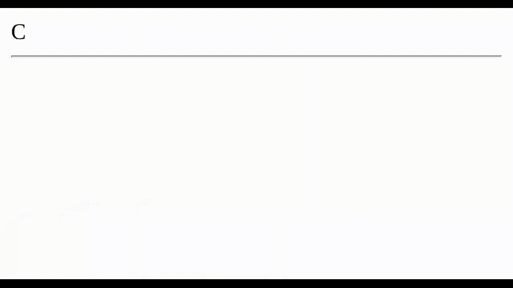

<p align="center">
  
</p>

<h1 align="center">Type Write - JS</h1>

## Como utilizar

``` js
// Passando uma string de array
writeArray(["Console", "Teste", "Lorem"]);

// Passando apenas uma string
write("Uma frase qualquer");
```